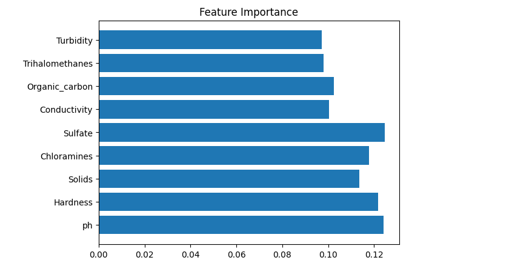

# AI-Based Water Quality Potability Classification

## Project Overview
This project uses Machine Learning to classify whether water is safe for drinking based on chemical parameters. The model is trained on a water potability dataset and predicts water safety using a Random Forest classifier.

## Problem Statement
Manual laboratory testing of water quality is time-consuming and resource-intensive. This project builds an AI model that can quickly predict potability using measurable parameters.

## Dataset
Water Potability Dataset (Kaggle)

Features include:
- pH
- Hardness
- Solids
- Chloramines
- Sulfate
- Conductivity
- Organic carbon
- Trihalomethanes
- Turbidity

Target:
- Potability (0 = Unsafe, 1 = Safe)

## Algorithm Used
Random Forest Classifier

Reasons:
- Works well with multi-feature environmental data
- Robust and stable
- Good performance without heavy tuning

## Model Steps
1. Data loading
2. Missing value imputation
3. Train-test split (80–20)
4. Model training
5. Evaluation using accuracy and confusion matrix

## Results
Model achieved ~69% accuracy on test data and showed strong detection of unsafe water samples.

## Tools & Technologies
- Python
- Scikit-learn
- Pandas
- Matplotlib
- Jupyter Notebook
- Azure ML (conceptual deployment)

## Project Screenshots

### Dataset Preview  

### Preprocessing & Model  

### Accuracy Output  

### Confusion Matrix  

### Classification Report  

### Feature Importance  

### Sample Prediction  

## How to Run
1. Clone repository  
2. Place dataset CSV in this folder  
3. Open `water_model.ipynb`  
4. Run all notebook cells

## Author
Praneetha M
